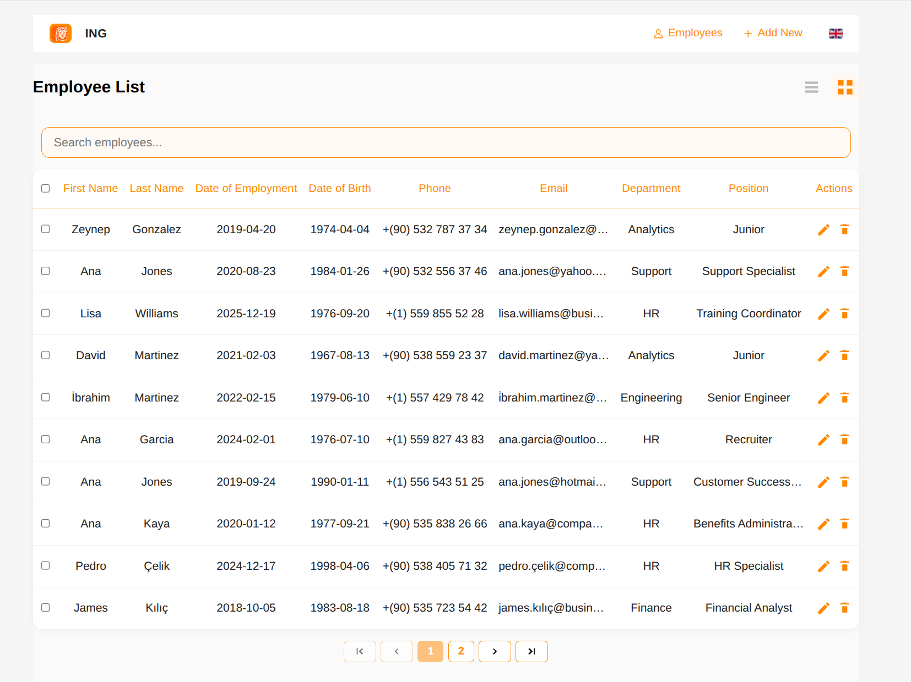
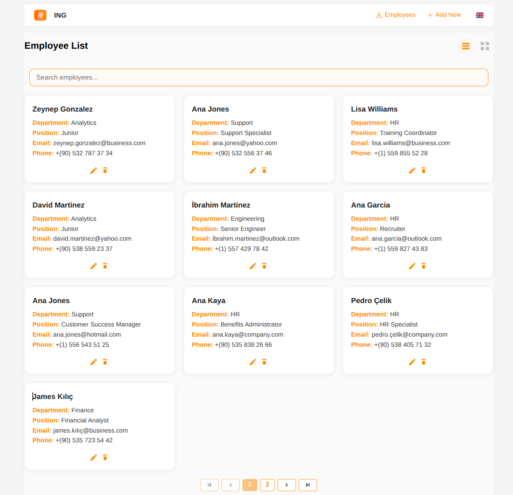
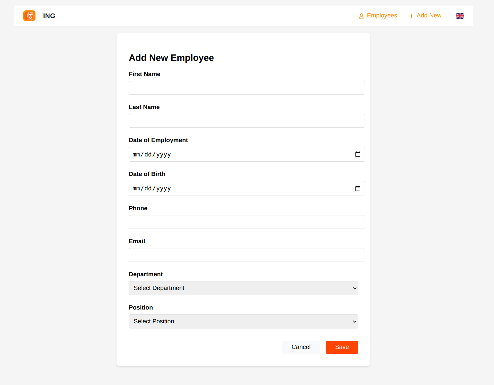
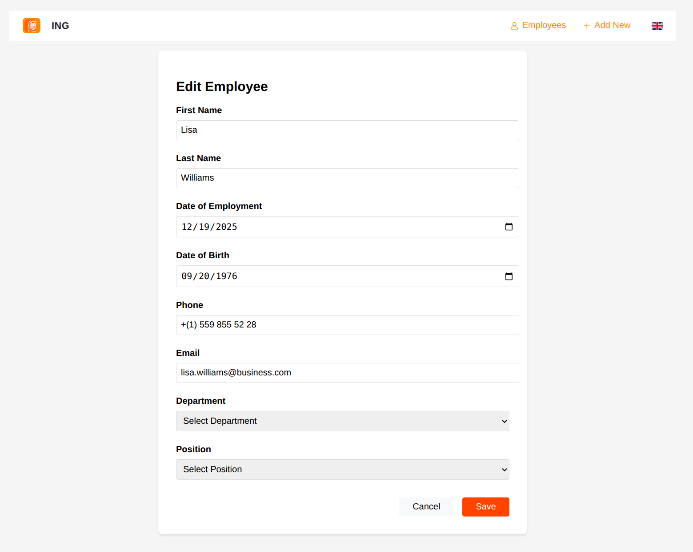
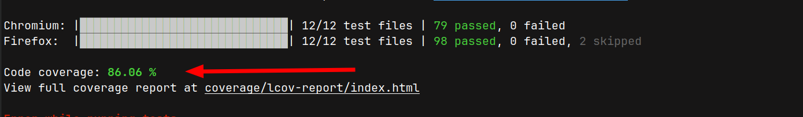

# Employee Management Application

A modern, responsive employee management application built with **LitElement** and **Redux**, featuring comprehensive CRUD operations, search functionality, pagination, and internationalization support.

## 🚀 Features

### Core Functionality
- **Employee CRUD Operations**: Create, Read, Update, Delete employee records
- **Advanced Search**: Real-time search across all employee fields
- **Pagination**: Efficient handling of large datasets
- **Bulk Operations**: Select multiple employees for batch operations
- **View Modes**: Table and card view options for different user preferences

### User Experience
- **Responsive Design**: Works seamlessly on desktop, tablet, and mobile devices
- **Modern UI**: Clean, intuitive interface with smooth animations
- **Form Validation**: Comprehensive client-side validation with user-friendly error messages
- **Confirmation Dialogs**: Safe deletion with confirmation prompts
- **Loading States**: Visual feedback during data operations

### Technical Features
- **State Management**: Centralized state with Redux pattern
- **Component Architecture**: Modular, reusable web components
- **Internationalization**: Multi-language support (English/Turkish) with easy language switching
- **Validation**: Robust form validation with custom rules
- **Error Handling**: Graceful error handling and user feedback

## 🛠️ Technology Stack

### Frontend Framework
- **LitElement**: Lightweight web component library
- **Lit**: Template library for efficient DOM updates
- **Web Components**: Native browser component system

### State Management
- **Redux Pattern**: Predictable state container
- **PWA Helpers**: Utilities for Progressive Web Apps

### Development Tools
- **Web Test Runner**: Modern testing framework
- **Playwright**: Browser automation for testing
- **ESLint**: Code quality and consistency
- **Prettier**: Code formatting

### Build Tools
- **Vite**: Fast build tool and development server
- **Rollup**: Module bundler for production builds

## 📁 Project Structure

```
employee_management_app/
├── src/
│   ├── components/
│   │   ├── employee-form/     # Employee form component
│   │   ├── employee-list/     # Employee list component
│   │   └── navigation/        # Navigation component
│   ├── store/                 # Redux store and actions
│   ├── utils/                 # Utility functions and constants
│   ├── i18n/                  # Internationalization files
│   └── index.js               # Main application entry
├── test/                      # Unit tests
├── coverage/                  # Test coverage reports
├── package.json
└── README.md
```

## 🚀 Getting Started

### Prerequisites
- Node.js (version 16 or higher)
- npm or yarn package manager

### Installation

1. **Clone the repository**
   ```bash
   git clone https://github.com/habibmevlut/employee_management_app.git
   cd employee_management_app
   ```

2. **Install dependencies**
   ```bash
   npm install
   ```

3. **Start development server**
   ```bash
   npm run serve
   ```

4. **Open your browser**
   Navigate to `http://localhost:8000`

## 🧪 Testing

### Run Tests
```bash
npm run test
```

### Run Tests with Coverage
```bash
npm run test:coverage
```

**Current Test Coverage: 85.1%** ✅

### Test Structure
- **Unit Tests**: Testing individual components and functions
- **Integration Tests**: Testing component interactions
- **Coverage Reports**: Detailed coverage analysis
- **Browser Testing**: Cross-browser compatibility testing

## 🏗️ Building for Production

### Build the Application
```bash
npm run build
```

### Preview Production Build
```bash
npm run preview
```

## 🌍 Internationalization

The application supports multiple languages:
- **English (en)**: Default language
- **Turkish (tr)**: Secondary language with complete translations

Language switching is available through the navigation component and persists across sessions.

## 📱 Responsive Design

The application follows a mobile-first approach with:
- **Breakpoints**: Responsive design for different screen sizes
- **Flexible Layouts**: CSS Grid and Flexbox for adaptive layouts
- **Touch-Friendly**: Optimized for touch interactions
- **Performance**: Optimized for mobile performance

## 🎨 UI/UX Features

### Design System
- **Color Scheme**: Orange-based theme (#ff8800, #ff4400)
- **Typography**: Modern, readable fonts
- **Spacing**: Consistent spacing system
- **Animations**: Smooth transitions and hover effects

### Components
- **Employee Cards**: Beautiful card layout for list view
- **Data Tables**: Sortable and filterable table view
- **Forms**: Validated input forms with error handling
- **Modals**: Confirmation dialogs and forms
- **Navigation**: Responsive navigation with language selector

## 🔧 Development

### Code Quality
- **ESLint**: Code linting and style enforcement
- **Prettier**: Automatic code formatting
- **TypeScript**: Type safety (optional)

## 📝 License

This project is licensed under the MIT License - see the [LICENSE](LICENSE) file for details.

## 🙏 Acknowledgments

- **LitElement Team**: For the amazing web component library
- **Open Web Components**: For testing utilities and best practices
- **Case Study Requirements**: For providing comprehensive requirements

## Application Screenshots

### List View


### Card View


### Add New Employee


### Edit Employee


### Unit Tests Coverage Results


---

**Built with ❤️ using modern web technologies**
